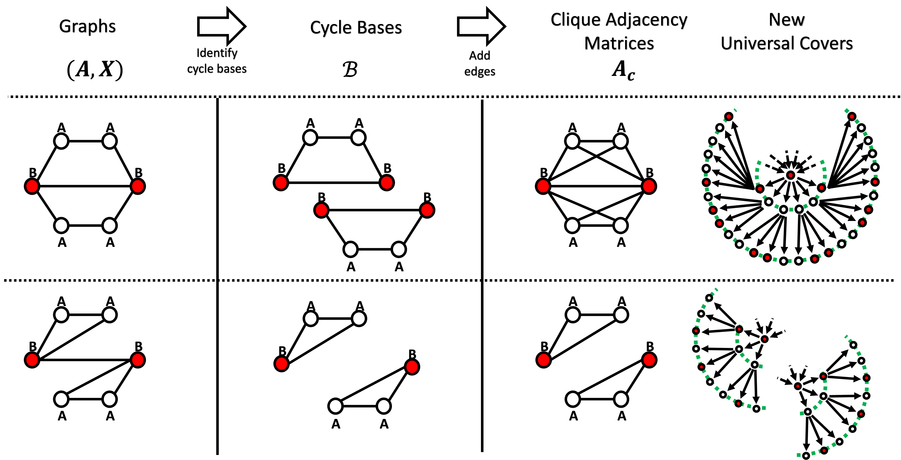
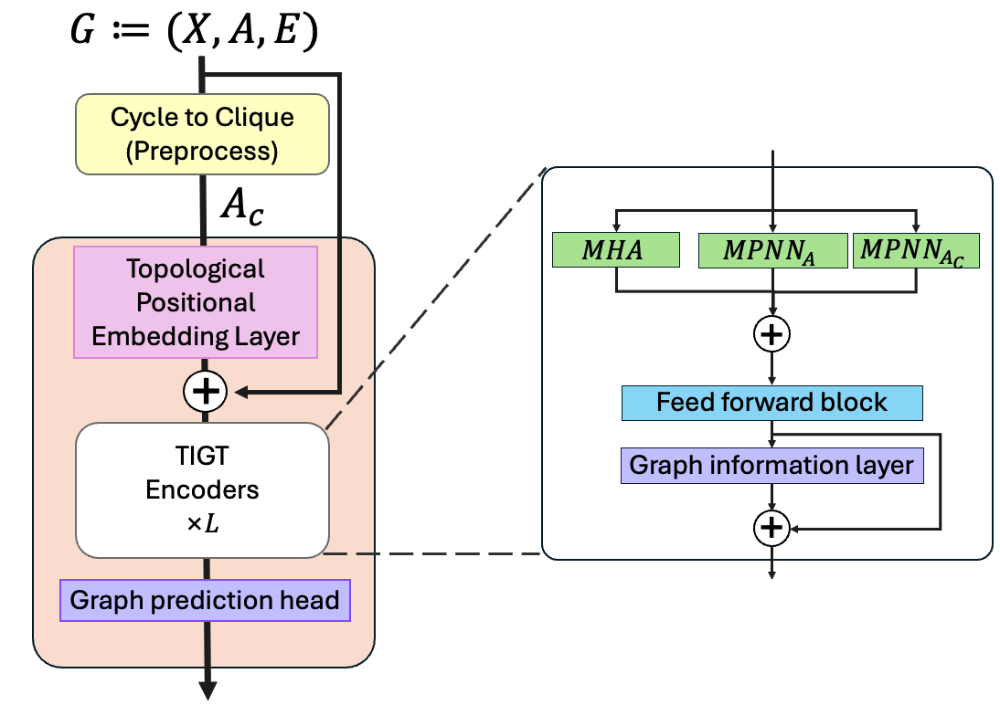

# Topology-Informed Graph Transformer (TIGT)
 
[](https://arxiv.org/abs/2402.02005)

This repository is the official implementation of [Topology-Informed Graph Transformer](https://arxiv.org/abs/2402.02005) (Choi et al., GRaM Workshop at ICML 2024).

<!--  -->
<!--  -->


The implementation is based on [GraphGPS (Rampasek et al., 2022)](https://github.com/rampasek/GraphGPS).

### Python environment setup with Conda

```bash
conda create -n graphgps python=3.10
conda activate graphgps

conda install pytorch=1.13 torchvision torchaudio pytorch-cuda=11.7 -c pytorch -c nvidia
conda install pyg=2.2 -c pyg -c conda-forge
pip install pyg-lib -f https://data.pyg.org/whl/torch-1.13.0+cu117.html

# RDKit is required for OGB-LSC PCQM4Mv2 and datasets derived from it.  
conda install openbabel fsspec rdkit -c conda-forge

pip install pytorch-lightning yacs torchmetrics
pip install performer-pytorch
pip install tensorboardX
pip install ogb
pip install wandb

conda clean --all
```

### Running TIGT

```bash
python main.py --cfg configs/TIGT/peptides-func-TIGT.yaml --repeat 1 seed 10 wandb.use False
```

The config files for the [GraphGPS](https://github.com/rampasek/GraphGPS) and [GRIT (Ma et al., ICML 2023)](https://github.com/liamma/grit) models work within their respective environments as uploaded on GitHub.

In the case of the CSL data, it is assumed that the values for nodes and edges are all uniformly set to 1.